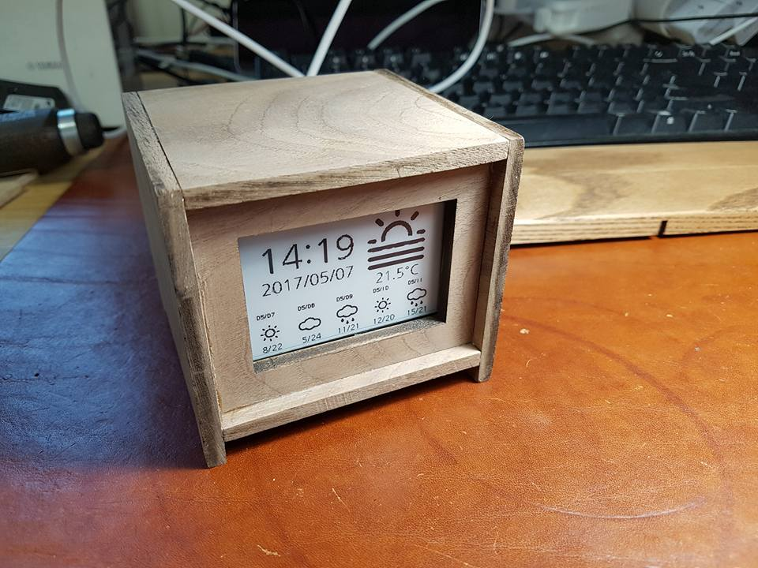

qock
==========

## What is it?
 This simple weather desk clock with e-paper display using Python

## How to use

 1. sign up : http://openweathermap.org/register

 2. rename from <strong>owm_config.py-SAMPLE</strong> to <strong>owm_config.py</strong>

 3. edit <strong>owm_config.py</strong>

         weather_api_key = 'your api key'
        weather_location = 'Suwon,kr'"""

 4. run ./tools/setup.sh

 5. run ./tools/install.sh

## References
 https://github.com/repaper/gratis
 https://github.com/Percheron-Electronics/gratis2
 http://www.percheron-electronics.uk/shop/
